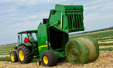

[](https://goreportcard.com/report/github.com/appscode/baler)

[Website](https://appscode.com) • [Slack](https://slack.appscode.com) • [Forum](https://discuss.appscode.com) • [Twitter](https://twitter.com/AppsCodeHQ)

# baler
Save and Load a collection of Docker Images from a compact archive



## Installation
```go
go get -u github.com/appscode/baler
```

## Usage
```sh
  baler [command] [flags]
  baler [command]

Available Commands:
  load        Load Docker images from a baler archive
  pack        Create a baler archive from manifest
  rmi         Remove images specified in manifest
  unpack      Unpack a baler archive into a directory
  version     Prints binary version number.

Flags:
      --alsologtostderr                  log to standard error as well as files
      --log_backtrace_at traceLocation   when logging hits line file:N, emit a stack trace (default :0)
      --log_dir string                   If non-empty, write log files in this directory
      --logtostderr                      log to standard error instead of files
      --stderrthreshold severity         logs at or above this threshold go to stderr (default 2)
  -v, --v Level                          log level for V logs
      --vmodule moduleSpec               comma-separated list of pattern=N settings for file-filtered logging

Use "baler [command] --help" for more information about a command.
```
### Sample Baler Manifest
```json
{
  "name": "test",
  "images": [
    "debian:8.6",
    "appscode/base:8.6",
    "appscode/kubed:1.5.0"
  ]
}
```

### Issues
Please file an issue if you think you've found a bug. Be sure to describe
 * How can it be reproduced?
 * What did you expect?
 * What actually occurred?
 * Go version, platform, etc. if possibly relevant.
